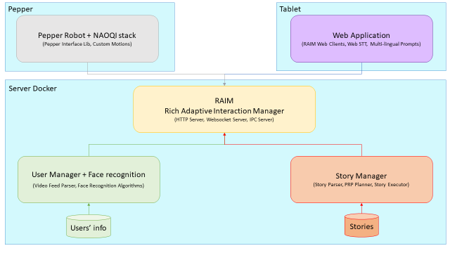
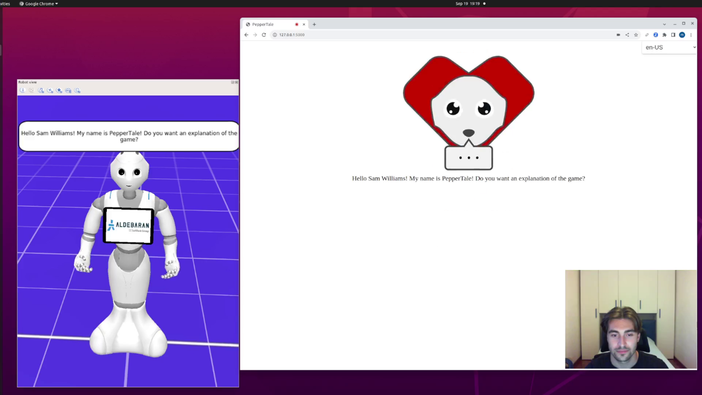
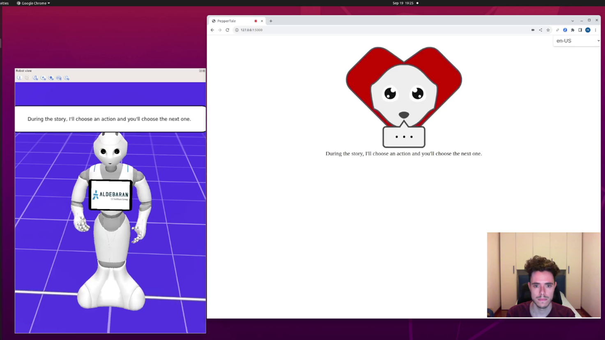
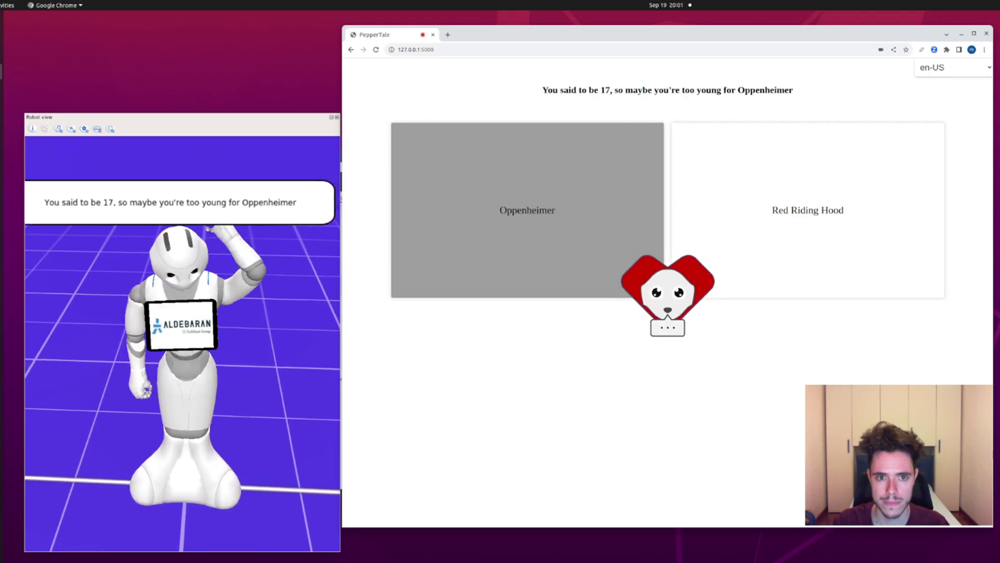
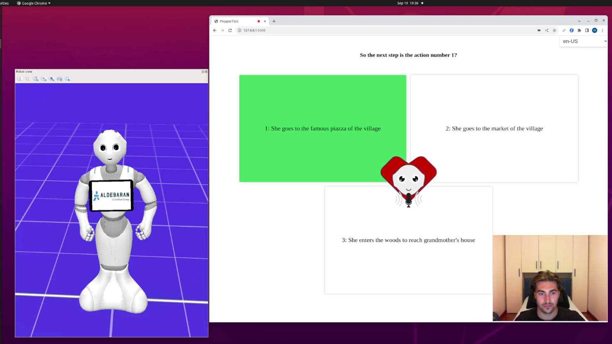
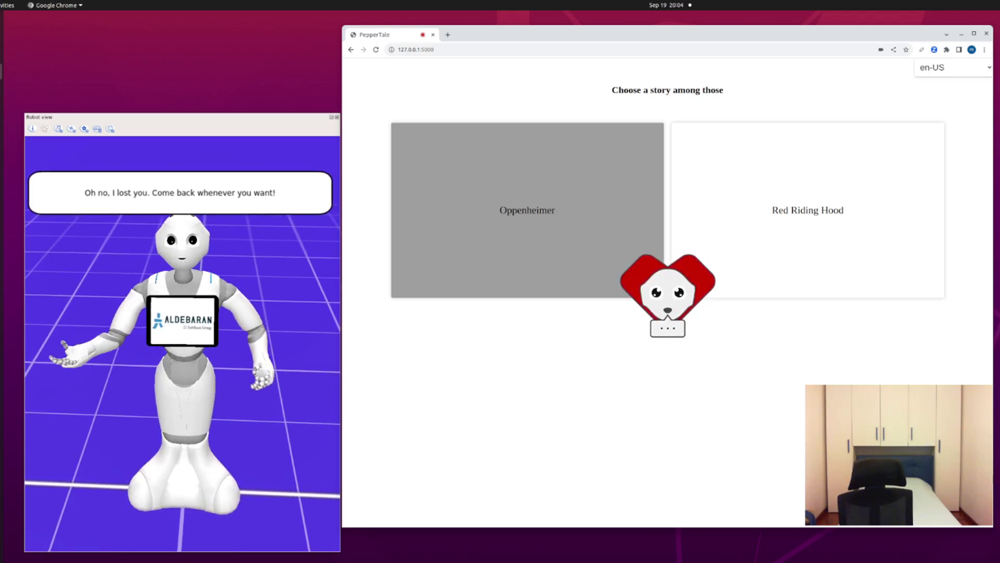

# PepperTale: Interactive Storytelling with Pepper
This project was created for the course "Elective in AI (HRI & RA)" at Sapienza University of Rome.  

The **HRI_Report.pdf** file describes the solution adopted in detail.  

## Abstract

Unlike typical scripted storytellers, PepperTale is an intelligent agent that collaboratively builds narratives with users. While the robot has its own narrative objectives, users engage in a creative tug-of-war to shape the story's outcome.  

PepperTale is able to craft a compelling story together with the user, telling it with words while mimicking with its body the mood and spirit of the events happening in the story. Every action chosen by the robot is a direct consequence of the user selected action, and is chosen intelligently to get to one of its wanted goals while counteracting the user actions.  

The robot uses speech recognition to receive the input from the user and uses the camera to do face detection and recognition, so to be able to address each user in a more personalized way. Finally, a screen is used as secondary aid to the interaction, showing in textual form what the robot says and giving feedback for the speech and face recognition.

## Architecture

    

## Images

    

    

    

    

    

